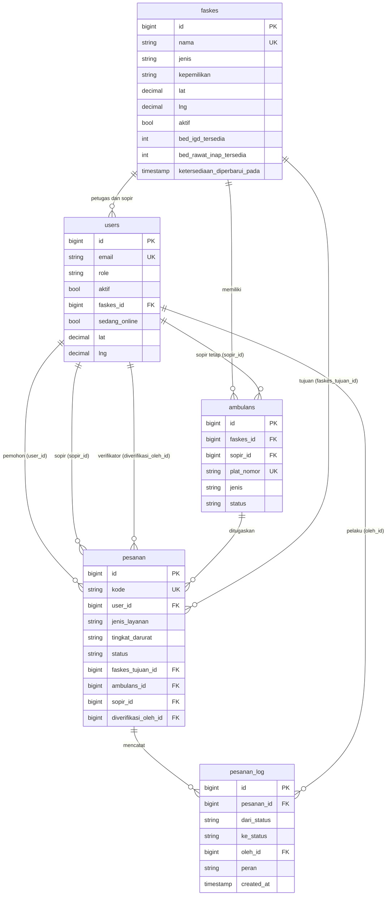

# ERD

Sumber: migrasi di `database/migrations` dan `docs/RANCANGAN_ALUR.md` §4.

```mermaid
erDiagram
    faskes ||--o{ ambulans : memiliki
    faskes ||--o{ users : "petugas dan sopir"
    users ||--o{ pesanan : "pemohon (user_id)"
    users ||--o{ pesanan : "sopir (sopir_id)"
    users ||--o{ pesanan : "verifikator (diverifikasi_oleh_id)"
    users ||--o{ ambulans : "sopir tetap (sopir_id)"
    ambulans ||--o{ pesanan : ditugaskan
    faskes ||--o{ pesanan : "tujuan (faskes_tujuan_id)"
    pesanan ||--o{ pesanan_log : mencatat
    users ||--o{ pesanan_log : "pelaku (oleh_id)"

    faskes {
        bigint id PK
        string nama UK
        string jenis
        string kepemilikan
        decimal lat
        decimal lng
        bool aktif
        int bed_igd_tersedia
        int bed_rawat_inap_tersedia
        timestamp ketersediaan_diperbarui_pada
    }
    users {
        bigint id PK
        string email UK
        string role
        bool aktif
        bigint faskes_id FK
        bool sedang_online
        decimal lat
        decimal lng
    }
    ambulans {
        bigint id PK
        bigint faskes_id FK
        bigint sopir_id FK
        string plat_nomor UK
        string jenis
        string status
    }
    pesanan {
        bigint id PK
        string kode UK
        bigint user_id FK
        string jenis_layanan
        string tingkat_darurat
        string status
        bigint faskes_tujuan_id FK
        bigint ambulans_id FK
        bigint sopir_id FK
        bigint diverifikasi_oleh_id FK
    }
    pesanan_log {
        bigint id PK
        bigint pesanan_id FK
        string dari_status
        string ke_status
        bigint oleh_id FK
        string peran
        timestamp created_at
    }
```

Lihat `KAMUS_DATA.md` untuk seluruh kolom.
